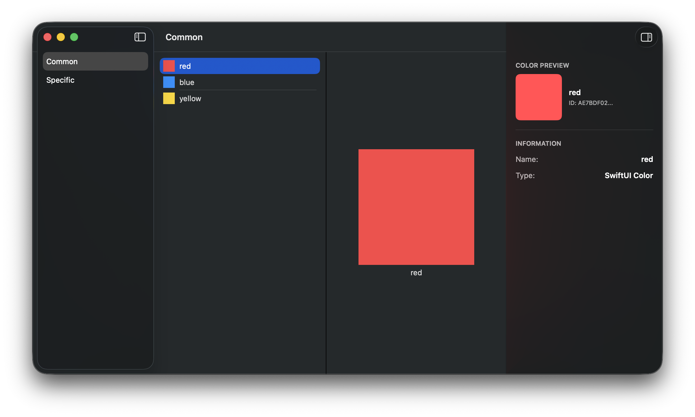

# NavigationSplitViewKit

[](https://swift.org/package-manager)
[](https://developer.apple.com/swift)
[](https://soundblaster.github.io/NavigationSplitView/documentation/navigationsplitviewkit/)

A production-ready Swift package demonstrating adaptive three-column layouts with SwiftUI's `NavigationSplitView`. Features synchronized state management, size class adaptations, and inspector panels for iOS, iPadOS, and macOS.



## Features

- ✅ **Swift Package Manager** - Easily integrate into any project
- ✅ **Three-column layout** - Sidebar, content, and detail columns with inspector panel
- ✅ **State synchronization** - Centralized navigation model keeps selections in sync
- ✅ **Size class adaptation** - Responsive behavior across iPhone, iPad, and Mac
- ✅ **Inspector panel** - Contextual information with adaptive visibility
- ✅ **Tuist support** - Demo app showcasing the library
- ✅ **Comprehensive documentation** - DocC tutorials and API reference

## Installation

### Swift Package Manager

Add NavigationSplitViewKit to your project via Xcode:

1. File → Add Package Dependencies...
2. Enter: `https://github.com/SoundBlaster/NavigationSplitView`
3. Select version/branch
4. Add to your target

Or add to your `Package.swift`:

```swift
dependencies: [
    .package(url: "https://github.com/SoundBlaster/NavigationSplitView", from: "1.0.0")
]
```

## Quick Start

```swift
import SwiftUI
import NavigationSplitViewKit

struct ContentView: View {
    @State private var navigationModel = NavigationModel()
    private let library = ColorLibrary()
    
    var body: some View {
        @Bindable var model = navigationModel
        
        NavigationSplitView(columnVisibility: $model.columnVisibility) {
            List(library.categories, selection: $model.selectedCategory) { category in
                NavigationLink(value: category) {
                    Text(category.name)
                }
            }
            .navigationTitle("Categories")
        } content: {
            CategoryView(
                category: model.selectedCategory,
                selection: $model.selectedColor
            )
        } detail: {
            DetailView(color: $model.selectedColor)
        }
    }
}
```

## Project Structure

```
NavigationSplitView/
├── Package.swift                                    # SPM manifest
├── Project.swift                                    # Tuist configuration
├── Sources/
│   └── NavigationSplitViewKit/                     # Main library
│       ├── Views/                                   # UI components
│       ├── Models/                                  # Data models
│       └── NavigationSplitViewKit.docc/            # Documentation
├── Demo/                                            # Demo application
│   ├── Project.swift                                # Tuist config for demo
│   └── NavigationSplitViewDemo/
├── Tests/                                           # Unit tests
└── .github/workflows/documentation.yml              # DocC deployment
```

## Documentation

- **[Online Documentation](https://soundblaster.github.io/NavigationSplitView/documentation/navigationsplitviewkit/)** - Complete API reference and tutorials
- **[Tutorial](https://soundblaster.github.io/NavigationSplitView/tutorials/navigationsplitviewkit/navigationsplitviewimplementation)** - Step-by-step implementation guide

### Building Documentation Locally

```bash
swift package --disable-sandbox preview-documentation --target NavigationSplitViewKit
```

## Demo Application

The demo app showcases all features of NavigationSplitViewKit using Tuist.

### Running with Tuist

```bash
cd Demo
tuist install  # If you have dependencies
tuist generate
open NavigationSplitViewDemo.xcodeproj
```

### Running with Xcode

Open `Demo/Project.swift` in Xcode and run directly (Tuist will auto-generate if installed).

## Requirements

- iOS 17.0+ / macOS 14.0+
- Xcode 15.0+
- Swift 5.9+

## Testing

Run the test suite:

```bash
swift test
```

All tests should pass:
```
Test Suite 'All tests' passed
Executed 5 tests, with 0 failures (0 unexpected) in 0.003 seconds
```

## Key Components

### Models
- **`NavigationModel`** - Centralized state for selections, column visibility, and inspector
- **`CustomColor`** - Color representation with identity
- **`CustomColorCategory`** - Grouped color collections
- **`ColorLibrary`** - Sample data provider

### Views
- **`CategoryView`** - Adaptive category display with size class handling
- **`ColorsSelectionList`** - Selectable list of colors
- **`DetailView`** - Color detail presentation
- **`InspectorPanel`** - Contextual information panel
- **`SizeClassAdaptiveView`** - Size class conditional rendering

## Migration from Xcode Project

This library was migrated from a standalone Xcode project to a Swift Package. Key improvements:

| Aspect | Before (Xcode Project) | After (SPM) |
|--------|----------------------|-------------|
| Workflow complexity | 179 lines, sed patches | ~50 lines, clean code |
| DocC commands | 2 (docbuild + process-archive) | 1 (generate-documentation) |
| Path patches | Required (HTML, JS, JSON) | Not required |
| Reusability | Cannot add to other projects | Available via SPM |
| Modularity | Monolith | Library + Demo |

## Contributing

Contributions are welcome! Please feel free to submit a Pull Request.

## License

This project is available under the MIT license. See the LICENSE file for more info.

## References

- [The SwiftUI cookbook for navigation](https://developer.apple.com/videos/play/wwdc2022/10054/) - WWDC 2022
- [What's new in SwiftUI](https://developer.apple.com/videos/play/wwdc2022/10052) - WWDC 2022
- [NavigationSplitView Documentation](https://developer.apple.com/documentation/swiftui/navigationsplitview) - Apple Developer

## Credits

Created to demonstrate proper implementation of `NavigationSplitView` beyond basic examples shown at WWDC 2022, addressing real-world issues with adaptive layouts and state synchronization.
